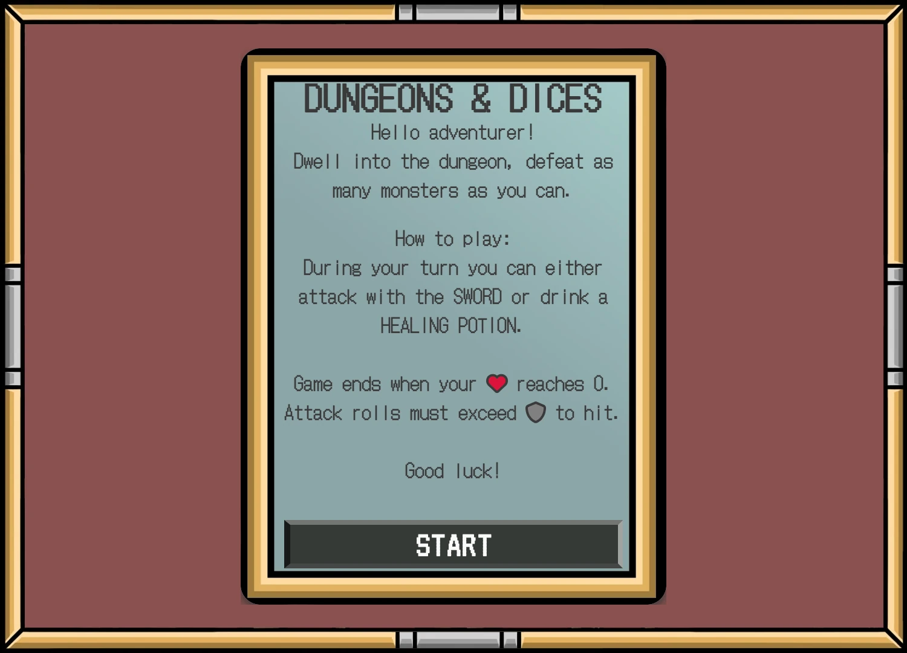
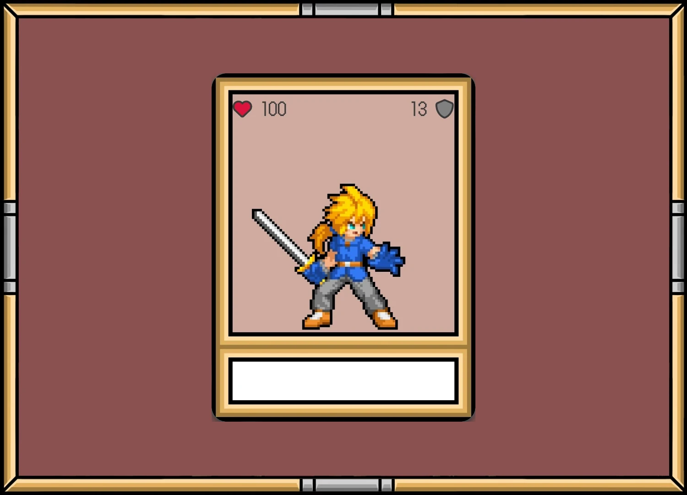
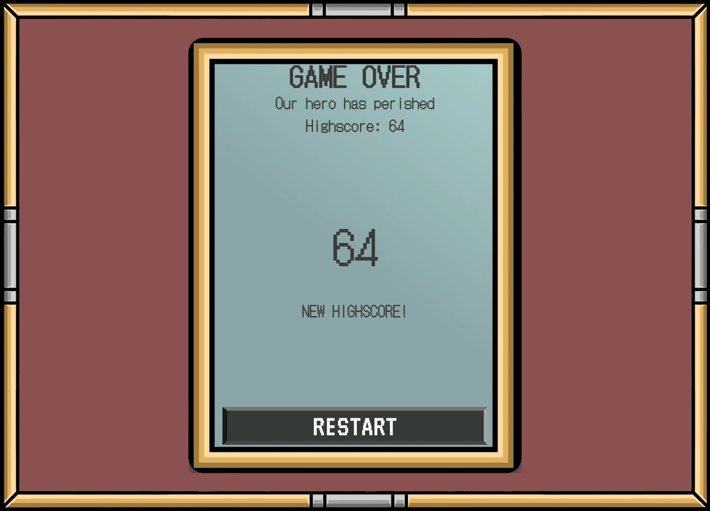
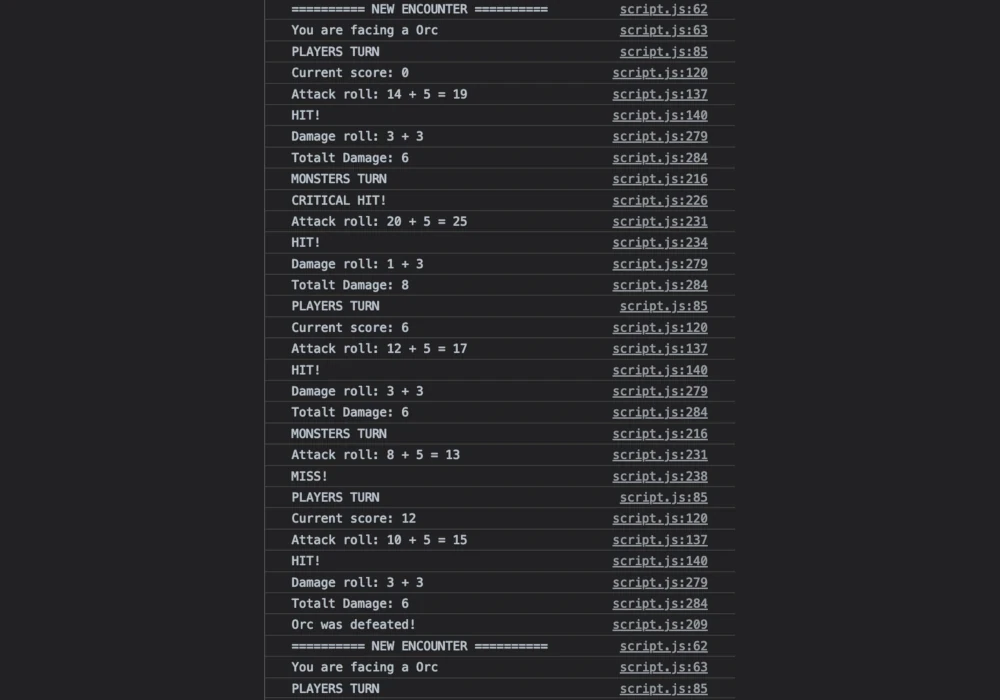

# DUNGEONS AND DICES
\
[DUNGEONS and DICES](https://dvudd.github.io/CI_PP2/) is a turned-based dungeon crawler where the player battles against different fantasy creatures, the effect of every action is decided by the roll of a dice.
## User Stories
- As a first time user, I want to quickly understand the game controls
- As a first time user, I want to quickly understand the turned-based game mechanic
- As a first time user, I want to feel nostalgic when looking at the retro-styled graphics
- As a user, I want to battle against fantasy monsters
- As a user, I want to feel the tension of dice rolls
- As a user, I want to encounter different types of monsters, so the game feels fresh and challenging each time
- As a returning user, I want to quickly start a new game
- As a returning user, I want to beat my old score
## Features
### Game Mechanics
- Turn-Based Gameplay:
	- The game operates on a turn-based system, alternating between the player's turn and the monsters' turn.
- Attack Roll:
	- To initiate an attack, the attacker rolls a d20 (20-sided die).
	- The result is compared to the target's Armor Class (AC).
	- If the roll is equal to or higher than the AC, the attack is successful.
- Damage Roll:
	- Once an attack hits, the damage is determined by rolling the attacker's damage dice.
	- For example, the player uses one d10 (10-sided die), while the Skeleton Mage has four d4's (four 4-sided dice).
	- The total damage is calculated by adding the result of the damage dice roll to the attacker's 'plsDmg' value.
- Critical Hits:
	- A roll of 20 on the Attack Roll is considered a critical hit.
	- In a critical hit, the number of damage dice is doubled.
	- For instance, the player would roll two d10's instead of one, and the Skeleton Mage would roll eigth d4's instead of four.
- Healing:
	- Similar to the Attack Roll, Healing is determinated by a roll of a d20.
	- The result is then added to the players Health Points (HP).
### Start Screen
The game starts with a short description on how the game works.\

### Player Card
This is the player character, besides a visual representation of the player, this is where the player's health and armor are shown.\

### Monster Cards
There are 8 different monster encounters, all with different strengths and weaknesses.\

### Ability Buttons
During the player's turn they have two options, either attack the monster or drink a healing potion to regain some health points.\

### Rolling the dice
The effect of any action is decided by the roll of a dice. Will the attack hit? How much damage will it do?\

### Game Over
When the player's health reaches 0, the game is over. Here the collected score is shown, and the user has the option to restart the game.\

## Future Features
While the game is fully functional, there are many ways to improve the experience
- Sound effects
- Selectable characters, example:
	- A Fighter with high defense but medium damage
	- A Thief with a chance to dodge incoming damage
	- A Wizard with low defense but high damage spells
- More player abilities, with different cooldowns.
- Equipable items that the player can find along the way
	- Better weapons
	- Better armor
	- Better healing potions
- More monsters
- Boss battles!
## Development
### Inspiration
The inspiration for this project came from [Dice Roll Game](https://codingscape.info/how-to-create-dice-roll-game-using-javascript/), but since I've been spending way too many hours in Baldurs Gate 3 lately, I wanted something involving a d20 dice. I also wanted to incorporate fantasy characters in the style of old-school RPG's into the game. The game should be turned-based where the player has time to think about their next move, but feel the tension of a dice roll to decide the outcome of that move. 
### Prototyping
The game foundation was started by sketching a layout in Balsamiq Wireframes where the idea evolved into making it a card game of sorts, think Magic: The Gathering but with fewer cards. The main focus of the UI is the cards of the player and the monster.
\
After a layout was decided, the basics were created with HTML and CSS to make a working prototype with a 'mobile-first' thought process. Making sure the game area fits into a small mobile screen. 
\
Once the site started to look like the wireframe layout, work began on the JavaScript where the main focus was on getting the basic gameplay to work, inspiration for the game rules came from [D&D BASIC RULES](https://media.wizards.com/2018/dnd/downloads/DnD_BasicRules_2018.pdf). To make sure the game mechanics worked as intended, work relied heavily on console logs to output what was happening under the hood.

### Look and Feel
To add visual feedback to the game, animations were created with tabletop cards in mind, but also how battles in old RPG's work. With this in mind and to save screen real estate, the card-flip animation was created, this creates a natural space where the d20 roll animation could be shown to the player. The damage animation was created to make the attack animation feel like it has impact. 

The visual theme of the cards continues in the theme of old-school RPGs where the graphical assets are pixelated and the reason why the retro-styled fonts (DotGothic16 and VT323) were selected.

To address the visual monotony that a one-color background might present, especially on larger screens, a play board-styled background image was added. The card frames and buttons are custom-designed to match the aesthetic of the background.

### Color codes
Colors were selected using coolors.co, matching them with the main colors of the background image and the play board.
Every monster have a unique background color to difference them more than just their graphic image.


<details><summary>Player Card</summary>


</details>

<details><summary>Goblins</summary>


</details>

<details><summary>Skeletons</summary>


</details>

<details><summary>Orc and Troll</summary>


</details>

## Testing
### Validator testing
#### HTML
No errors were returned when passing through the [W3C Markup validator](https://validator.w3.org/).
#### CSS
No errors were found when passing through the [W3C CSS Validator](https://jigsaw.w3.org/css-validator/).
#### JavaScript
No errors were found when passing through the [JShint](https://jshint.com) analysis tool.
#### Google Chrome Lighthouse Reports
Här kommer lighthouse presenteras
### Manual testing
#### UI Testing
| Element | Expected Behavior | Outcome |
| ------- | ------------------ | ------- |
| Start Screen | Shows at the beginning | Confirmed |
| Start Screen | Shows the How to play instructions | Confirmed |
| Start Button | Shows on the Start Screen | Confirmed |
| Player Card | Shows the graphic | Confirmed |
| Player Card | Shows the correct amount of HP and AC | Confirmed |
| Attack Button | Shows after the game has been started | Confirmed |
| Attack Button | Shows the Flip Card animation | Confirmed |
| Attack Buttton | Darkens when its the monsters turn | Confirmed |
| Attack Button | Hides on smaller screens when its the monster's turn | Confirmed |
| Ability Button | Shows after the game has been started | Confirmed |
| Ability Button | Shows the Flip Card animation | Confirmed |
| Ability Button | Darkens when the its the monster's turn | Confirmed |
| Ability Button | Hides on smaller screens when its the monster's turn | Confirmed |
| Roll Animation | Shows random numbers 1-20 | Confirmed |
| Roll Animation | Stops at a random number | Confirmed |
| Roll Animation | Shows Critical Hit/Hit/Miss | Confirmed |
| Attack Animation | Only shows if the player hits | Confirmed |
| Attack Animation | Shows for every monster attack | Confirmed |
| Heal Animation | Shows the correct amount healed | Confirmed |
| Damage Taken Animation | Shows when the player attacks | Confirmed |
| Damage Taken Animation | Shows when the monster attacks | Confirmed |
| Monster Card | Show the graphics for the selected monster | Confirmed |
| Monster Card | Shows the correct name for the selected monster | Confirmed |
| Monster Card | Shows the correct amount of HP and AC | Confirmed |
| Monster Card | Darkens when the Players Card is flipped up | Confirmed |
| Monster Card | Displays as above the Player Card during attack animation | Confirmed |
| Game Over Screen | Shows when the player HP reaches 0 | Confirmed |
| Game Over Screen | Shows the Game Over text | Confirmed |
| Game Over Screen | Shows the total amount of points collected | Confirmed |
| Restart Button | Shows on the Game Over Screen | Confirmed |
#### Functional Testing
| Feature | Expected Behavior | Outcome |
| ------- | ------------------ | ------- |
| Start Button | Starts the game | Confirmed |
| Game Loop | Runs while the players HP is above 0 | Confirmed |
| Game Loop | Selects a random encounter if none is present | Confirmed |
| Game Loop | Waits for the player to complete it's turn | Confirmed |
| Game Loop | Waits for the monster to complete it's turn | Confirmed |
| Game Loop | Ends when the players HP is equal or below 0 | Confirmed |
| Roll Dice | Returns a random number between 1 and the input number | Confirmed |
| Attack Roll | Compares the output of rollDice(20) to the targets AC | Confirmed |
| Miss | If attack roll is below the targets AC | Confirmed |
| Hit | If attack roll is equal or above targets AC | Confirmed |
| Critical Hit | Is only true if the attack roll is equal to 20 | Confirmed |
| Critical Hit | Doubles the number of hit dice(s) | Confirmed |
| Damage Roll | Rolls the correct amount and value of hit dices | Confirmed |
| Damage Roll | Adds the value of the attacker's toHit after the dice(s) been rolled | Confirmed |
| Damage Roll | If Critical Hit, double the amount of hit dices | Confirmed |
| Heal | Uses rollDice(20), adds the value to the Players current hitpoints | Confirmed |
| Player Turn | Waits for all animations to end | Confirmed |
| Monster Turn | Waits for all animations to end | Confirmed |
| Game Over | Removes the current monster | Confirmed |
| Restart Button | Resets players HP | Confirmed |
| Restart Button | Resets the players score | Confirmed |
| Buttons | Can only be pressed once | Confirmed |
| Buttons | Can only be pressed during the player's turn | Confirmed |
#### Browser testing
| Operating System | Browser | Version |
| ------- | ------------------ | ------- |
| iOS | Safari | 17.1.1 |
| iPadOS | Safari | 17.1.1 |
| macOS | Safari | 17.0 |
| macOS | Mozilla Firefox | 119.0.1 |
| macOS | Google Chrome | 119.0.6045.159 |
| Windows 10 | Microsoft Edge | |
| Windows 10 | Mozilla Firefox | |
#### Device Testing
- iPhone 11
- iPhone 11 Pro
- iPhone 12 Mini
- iPhone 13
- iPad Air
- MacBook Air
- Windows 10 PC
### Bugs
<details><summary>Bug: No new monster is picked after the player defeats the current one</summary>

This was fixed by creating a function to make a copy of the randomly selected monster.
```js
currentMonster = copyMonster(selectRandomMonster());
/**
* Copies the stats from a monster in the monster array
* @param {*} monster
* @returns
*/
function copyMonster(monster) {
return Object.assign({}, monster);
}
```

</details>
<details><summary>Bug: The player can make multiple attacks in one turn by pressing the attack button twice</summary>

The EventListener for the attack button was in the `gameLoop()` function, but the EventListener was never disabled, making it possible to press the button in quick succession to run the `playerTurn()` function multiple times.
To fix this I moved the EventListener from the `gameLoop()`:
```js
if (isPlayerTurn) {
	 // It's the player's turn
	 // Wait for the player to take it's action
	 let playerActionBtn = document.getElementById('attack');
	 playerActionBtn.addEventListener('click', playerTurn);
	 }
```
To the `playerTurn()`function, where the EventListener is removed when the user presses the button
```js
async function playerTurn() {
	 // Prevent the button to be pressed several times
	 function onPlayerActionClick() {
		 playerActionBtn.removeEventListener('click', onPlayerActionClick);
		 playerAttack();
	 }
	 // Listener for attack button
	 let playerActionBtn = document.getElementById('attack');
	 playerActionBtn.addEventListener('click', onPlayerActionClick);
 }
 The old `playerTurn()`function was renamed to `PlayerAttack()`
```

</details>
<details> <summary>Bug: Damage rolls are higher than intended</summary>

In the `rollForDamage()`function, the number of hit dices are looped to ensure the case where more than 1 hit dice is used. However, there was a typo that caused the loop to roll 1 extra dice.
```js
for (let i=0; i <= creature.numDices; i++) {
		 damage += creature.hitDice + creature.plusDmg;
	 }
```
This was fixed by fixes the typo.
```js
  for (let i=0; i < creature.numDices; i++) {
		 damage += creature.hitDice + creature.plusDmg;
	 }
```

</details>
<details><summary>Bug: Monsters damage is miscalculated</summary>

There was a typo in the `monsterTurn()`function.
This added the players toHit value to the monsters attack.
```js
let attackRoll = diceRoll + player.toHit;
```
This was fixed with:
```js
let attackRoll = diceRoll + currentMonster.toHit;
```

</details>
<details><summary>Bug: Damage is not calculated correctly</summary>

This bug was caused when I tried to clean up the code.
In commit `7330400` I changed the hitDice value in both the player and monster array from:
```js
const player = {
	...
	hitDice: d10,
	...
}
const monsters = {
	...
	hitDice: d6,
	...
	hitDice: d12,
}
function rollForDamage(creature, crit) {
	...
	damage += creature.hitDice() + creature.plusDmg;
	...
}
```
to:
```js
const player = {
	...
	hitDice: d10(),
	...
}
const monsters = {
	...
	hitDice: d6(),
	...
	hitDice: d12(),
}
function rollForDamage(creature, crit) {
	...
	damage += creature.hitDice + creature.plusDmg;
	...
}
```
This caused the hitdice functions to be run only once at the start of the game and not be a random number for each roll as intended. The solution was to revert the changes.

</details>
<details><summary>Bug: Start button could not be pressed in Safari</summary>

This bug only occured in MacOS Safari, the original plan was to have the Start button flip together with the player card, like it was a part of it. However in testing I realised that only one half of the button was clickable. This has something with how Safari interperrets the `transform-style: preserve-3d;` in CSS, I could not fix it without moving the Start button from the player-card div to the btn-area div (where it logically belongs). However after that I struggled with getting the button flip animation to work smoothly with the card, I eventually settled with creating a fade animation for the button.
```css
.button-fade {
	animation: buttonFade ease 1s;
}
@keyframes buttonFade {
	0% { opacity: 0; }
	100% { opacity: 1; }
}
```

</details>
<details><summary>Bug: Hit misses when rolled equal to AC</summary>

When attack roll is equal to the target AC it should hit. A typo in the JS caused it to miss.
```js
if ((attackRoll > currentMonster.armorClass) || (crit)) {...}
if ((attackRoll > player.armorClass) || (crit)) {...}
```
was changed to:
```js
if ((attackRoll >= currentMonster.armorClass) || (crit)) {...}
if ((attackRoll >= player.armorClass) || (crit)) {...}
```

</details>

### Known Bugs
No known bugs remaining
## Technologies used
- IDE: Microsoft VS Code
- Repository: GitHub
- Image Editor: [GIMP](https://www.gimp.org)
- Image upscaler: [Lospec](https://lospec.com/pixel-art-scaler/)
- Color palette picker: [Coolors](https://coolors.co)
- Favicon generator: [favicon.io](https://favicon.io/favicon-converter/)
### Languages
- HTML5
- CSS
- JavaScript
### Libraries
1. Font Awesome
	- Font Awesome was used to add icons on all pages for aesthetic reasons.
2. Google Fonts
	- Google Fonts was used to import the fonts DotGothic16 and V323.
## Deployment
[Click here to view the project](https://dvudd.github.io/CI_PP2/)
### GitHub Pages
The project was deployed to GitHub Pages using the following steps:
1. Log in to GitHub and locate the [GitHub Repository](https://github.com/dvudd/CI_PP2)
2. At the top of the Repository (not top of the page), locate the "Settings" Button on the menu.
3. Scroll down the Settings page until you locate the "GitHub Pages" Section.
4. Under "Source", click the dropdown called "None" and select "Master Branch".
5. The page will automatically refresh.
6. Scroll back down through the page to locate the now published site [link](https://github.com) in the "GitHub Pages" section.
### Forking the GitHub Repository
By forking the GitHub Repository, we make a copy of the original repository on our GitHub account to view and/or make changes without affecting the original repository by using the following steps:
1. Log in to GitHub and locate the [GitHub Repository](https://github.com/dvudd/CI_PP2)
2. At the top of the Repository (not top of the page) just above the "Settings" Button on the menu, locate the "Fork" Button.
3. You should now have a copy of the original repository in your GitHub account.
### Making a Local Clone
1. Log in to GitHub and locate the [GitHub Repository](https://github.com/dvudd/CI_PP2)
2. Under the repository name, click "Clone or download".
3. To clone the repository using HTTPS, under "Clone with HTTPS", copy the link.
4. Open Git Bash
5. Change the current working directory to the location where you want the cloned directory to be made.
6. Type `git clone`, and then paste the URL you copied in Step 3.
```

$ git clone https://github.com/dvudd/CI_PP2

```
7. Press Enter. Your local clone will be created.
8. Open `index.html` in your browser.
## Credits
### Media:
-  Monster Assets were created by [Sagak art](https://sagak-art-pururu.itch.io)
	- [Card RPG) Monsters](https://sagak-art-pururu.itch.io/cardrpg-monsters)
	- [Card RPG) UI&Characters](https://sagak-art-pururu.itch.io/cardrpg-ui)
	- [Card RPG) Items](https://sagak-art-pururu.itch.io/cardrpg-items)
- Background image were created by [TornioDuva](https://tornioduva.itch.io/tornioduva-card-pack)
- Favicon was downloaded from [flaticon](https://www.flaticon.com/)
### Code:
- Sleep function: https://stackoverflow.com/questions/951021/what-is-the-javascript-version-of-sleep
- popup function: https://www.youtube.com/watch?v=AF6vGYIyV8M
- Card flip: https://www.w3schools.com/howto/howto_css_flip_card.asp
- Card Shake: https://www.w3schools.com/howto/howto_css_shake_image.asp
- Prevent scrolling: https://stackoverflow.com/questions/28411499/disable-scrolling-on-body
- Button design: https://codepen.io/Brandon-Stoyles/pen/RajYmd
### Acknowledgements
\
This is my Portfolio Project 2 as part of the Full Stack Software Developer program at [Code Institute](https://codeinstitute.net/).\
David Eriksson 2023